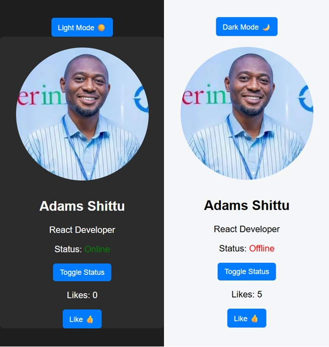

# React Personal Dashboard

A beginner-friendly React project that demonstrates core React concepts
including components, state, props, conditional rendering, and styling.

## Features

- Profile card component
- Like counter using useState
- Online/offline status toggle
- Dark and light mode
- Reusable components
- Styled with CSS
- Version controlled with Git

## Concepts Learned

- JSX
- Components
- useState hook
- Props and data flow
- Conditional rendering
- State-driven styling

## How to Run

```bash
npm install
npm run dev
```

## Screenshot


